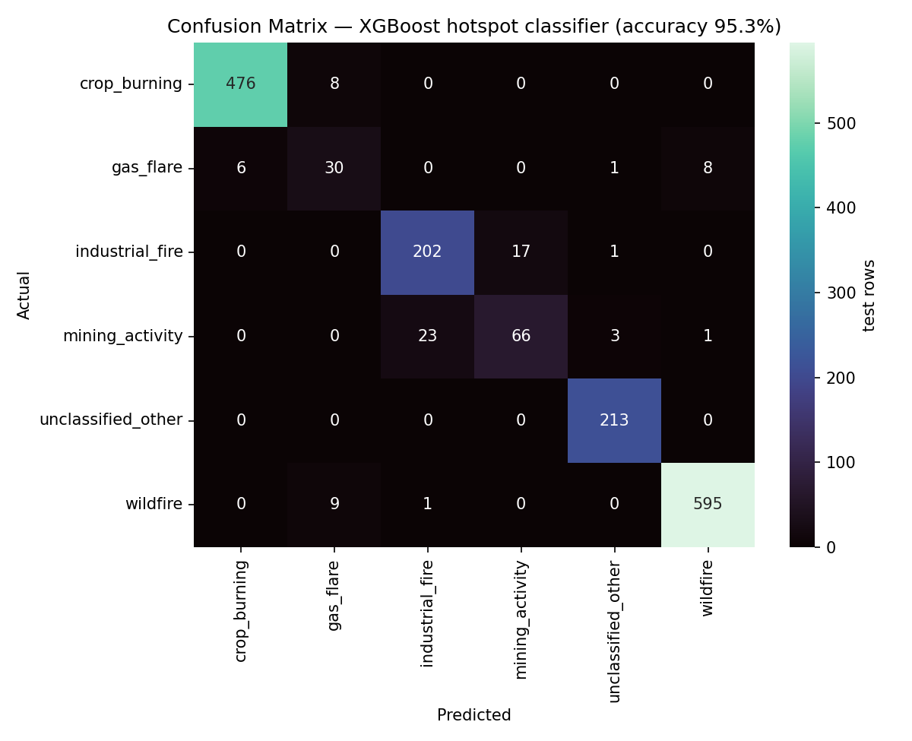
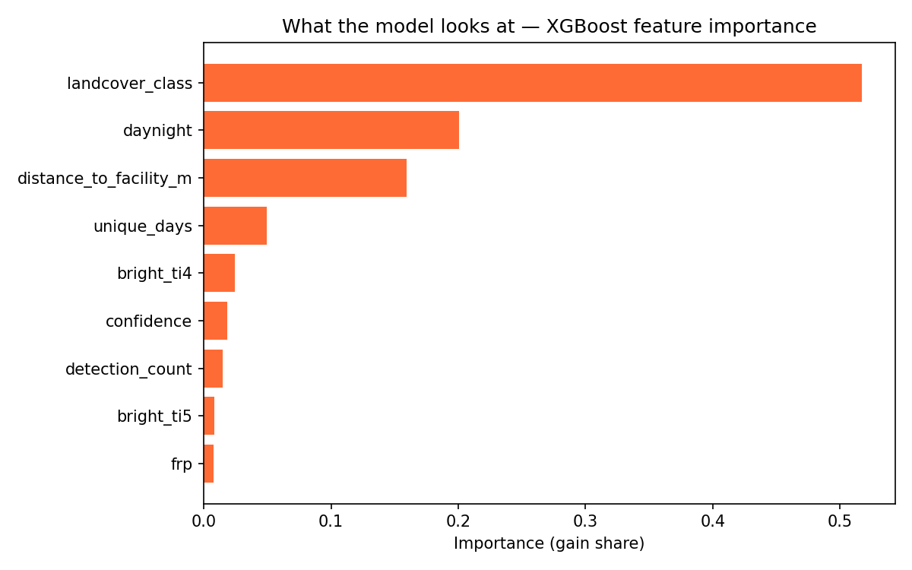

# Model Validation Report

**Model:** XGBoost (200 trees, depth 6, lr 0.1) · **Data:** 8297 labeled FIRMS hotspots
**Protocol:** stratified 80/20 train/test split, `random_state=42` — identical to `ml_scripts/train_model.py`

| Metric | Score |
|---|---|
| **Accuracy** | **95.3%** |
| Precision (weighted) | 95.3% |
| Recall (weighted) | 95.3% |
| F1 (weighted) | 95.3% |

Deployed `model.pkl` reproduces this: ✅ yes (accuracy 95.4%).

## Per-class performance

| Class | Precision | Recall | F1 | Test rows |
|---|---|---|---|---|
| crop_burning | 98.8% | 98.3% | 98.6% | 484 |
| gas_flare | 63.8% | 66.7% | 65.2% | 45 |
| industrial_fire | 89.4% | 91.8% | 90.6% | 220 |
| mining_activity | 79.5% | 71.0% | 75.0% | 93 |
| unclassified_other | 97.7% | 100.0% | 98.8% | 213 |
| wildfire | 98.5% | 98.3% | 98.4% | 605 |

## What the model relies on

Top features: **landcover_class** (51.7%), **daynight** (20.0%), **distance_to_facility_m** (15.9%).

## Honest limitations

- Labels come from the team's rule-based heuristic (`source_type`), so this measures
  agreement with those rules — a human-labeled subset would strengthen the claim.
- Random (not spatial) split: neighbouring hotspots share conditions, so real-world
  accuracy on a brand-new region may be somewhat lower.
- Landcover coverage is partial for live data (see enrichment notes).

*Generated 2026-09-26 10:33 UTC · run `python validate_model.py` to regenerate*